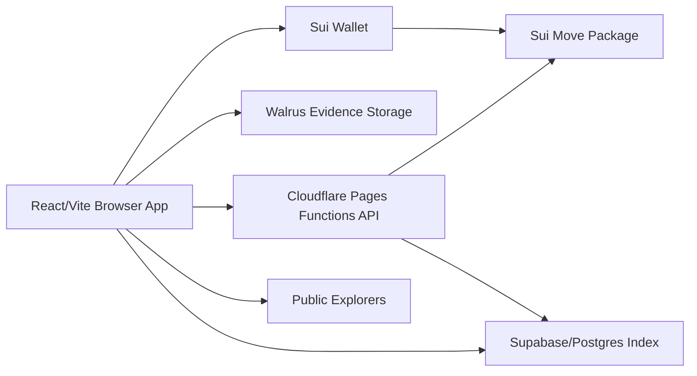
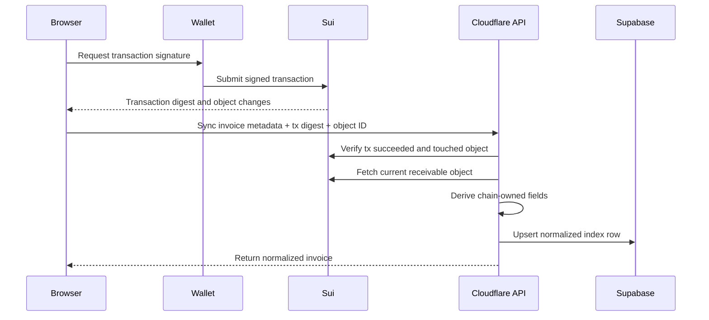
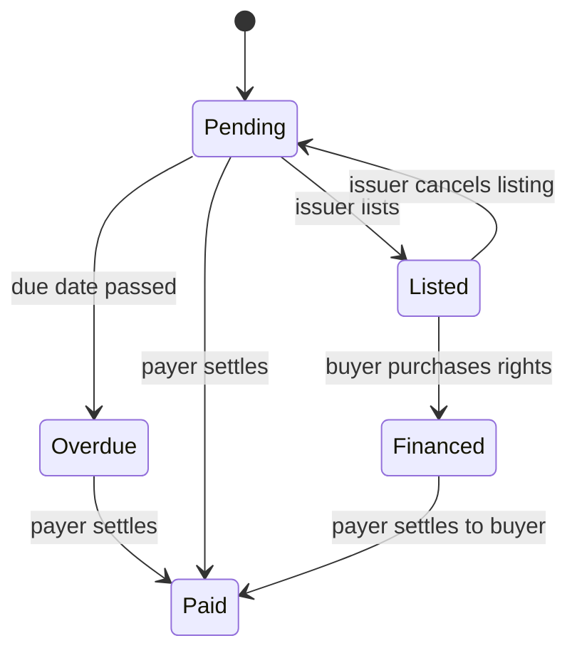

# InvoNFT System Design

This document is the design guardrail for the whole project. Keep it updated
whenever the app, Move package, API, storage, or deployment model changes.

## Product Boundary

InvoNFT is a non-custodial receivables workflow:

- Issuers create invoice receivable objects.
- Evidence is attached through Walrus blobs.
- Buyers can purchase payment rights at a discount.
- Payers settle to the current on-chain payment recipient.
- The platform can collect a fee on financing purchases.

For the current deployment, this is a strict Sui Testnet demo. It should behave
like a production system, but it is not Mainnet real-money production.

## High-Level Architecture

Development mode may read/write Supabase directly for speed. Production mode
must use the Cloudflare Functions index API.

## Source Of Truth

Sui is the state authority for:

- receivable ownership and object ID
- issuer wallet
- payer wallet
- payment recipient
- amount
- due date
- invoice number
- paid/listed/financed/overdue state
- financing price
- platform-fee routing

Walrus is the evidence blob store for:

- generated evidence JSON
- optional invoice PDF/image upload
- blob IDs used by the Sui object and UI verification panel

Supabase is an index/cache for:

- fast dashboard reads
- search/filtering
- shareable invoice pages
- UI metadata not stored on-chain, such as client name/email/description

Supabase must not be treated as the settlement authority.

## Trust Boundaries

Browser:

- Builds transactions.
- Requests wallet signatures.
- Uploads evidence.
- Shows indexed state.
- May submit UI metadata, but must not be trusted for chain-owned fields in
  production.

Wallet:

- Owns user identity.
- Signs Sui transactions.
- Determines issuer, buyer, or payer authority by connected address.

Cloudflare Functions:

- Holds server-side Supabase service role key.
- Verifies submitted Sui transactions.
- Reads current Sui object state.
- Derives chain-owned fields before syncing the index.

Supabase:

- Stores queryable rows.
- Should use read-only/no anon write policies in production.
- Service role key must stay server-side only.

## Production Sync Contract

Production sync follows this sequence:

The API may accept client metadata such as client name, client email, and
description. It must derive chain-owned fields from Sui.

## Core State Flow

Design invariant: after financing, payment must settle to `payment_recipient`,
not necessarily the original issuer.

## Security Rules

- Never commit real private keys, mnemonics, Supabase service role keys, or
  privileged publisher credentials.
- Never expose service role keys in `VITE_*` variables.
- Keep `SUPABASE_SERVICE_ROLE_KEY` only in Cloudflare Pages Function env vars.
- Use `VITE_*` only for values that can be public in the browser.
- In production mode, do not mutate persisted state unless a Sui transaction
  succeeded and the API verified the object.
- Do not show demo role switching in production mode.
- Do not upload sensitive real invoice documents publicly without an encryption
  and access-control design.

## Consistency Model

The UI is eventually consistent with Sui:

1. Wallet submits a transaction.
2. Browser optimistically updates local state only after transaction success.
3. Cloudflare API normalizes state from Sui into Supabase.
4. Refresh reloads indexed state.

If index sync fails, the Sui object remains the authority. A production
background indexer should repair missed rows from Sui events and object reads.

## Failure Modes

Sui transaction fails:

- Do not update Supabase.
- Keep the current UI state.
- Show a clear transaction failure message.

Walrus upload fails:

- Local/development may continue with placeholder evidence.
- Judging/production demos should use real Walrus blob IDs.
- Real production needs retries, size limits, and private evidence policy.

Cloudflare API fails:

- Do not claim persisted state changed.
- User can retry sync after transaction success.
- Background repair/indexing should be added before Mainnet.

Supabase unavailable:

- Dashboard may fail to load indexed rows.
- Sui objects and transactions remain valid.
- Production should include observability and index repair.

## Scalability Notes

Current design is enough for demo and early beta:

- Static frontend scales through Cloudflare Pages.
- Functions can handle sync requests.
- Supabase can handle indexed reads/search for small-to-medium usage.

Before high-volume production:

- Add a background Sui event indexer.
- Add pagination and server-side search.
- Add rate limits to API routes.
- Add monitoring and alerting.
- Add backup/replay from Sui events.

## Environment Modes

Development:

- Optional direct Supabase reads/writes.
- Demo fallback state allowed.
- Role switcher allowed.

Staging:

- Sui Testnet.
- Real wallet signatures.
- No fake status mutations.
- Can use stricter API/indexer path.

Production-style Testnet demo:

- `VITE_INVO_APP_MODE=production`
- `VITE_INVO_INDEXER_URL=/api`
- no demo role controls
- no direct browser Supabase writes
- Function verifies Sui transaction and object

Mainnet production:

- Mainnet package/object IDs.
- Mainnet RPC.
- legal/compliance/KYB/KYC.
- private evidence handling.
- background indexer and monitoring.

## Design Decisions To Preserve

- Sui, not Supabase, is the financial state authority.
- Supabase is an index, not a ledger.
- Browser signs transactions but does not own server authority.
- Cloudflare Functions protect server-only secrets.
- Payment routing must always follow the on-chain payment recipient.
- Platform fee is charged during financing purchase, not final payer settlement.
- Evidence can be public for demos, but real invoices need privacy controls.

## Open Design Work

- Event-driven indexer that reconstructs rows from Sui events.
- Authenticated organization/business accounts.
- Payer invite and acceptance flow.
- Encrypted Walrus evidence and access grants.
- Production observability and audit logs.
- Mainnet compliance and legal review.
- Kiosk or transfer-policy marketplace hardening.
